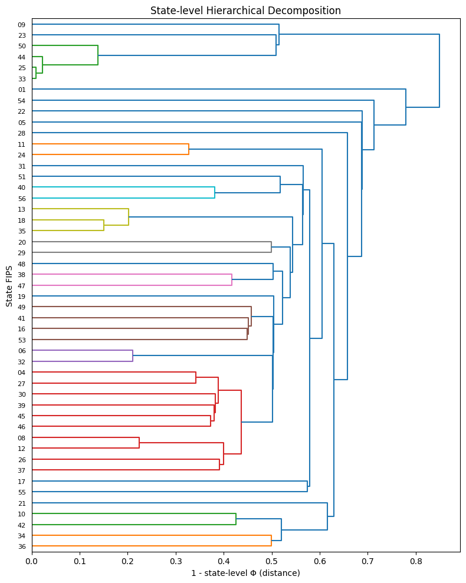
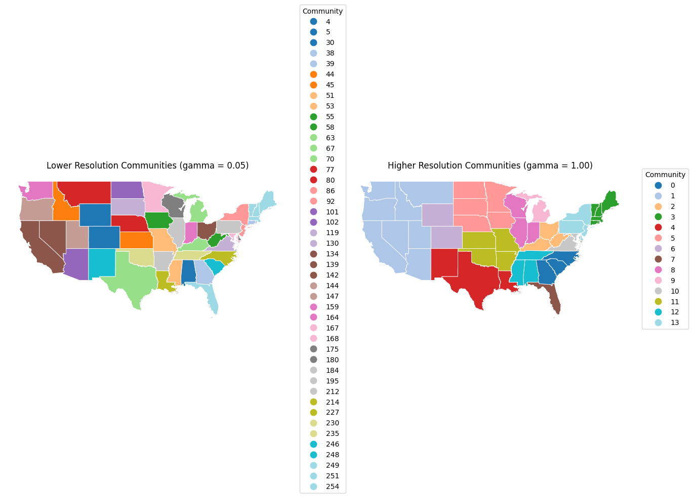
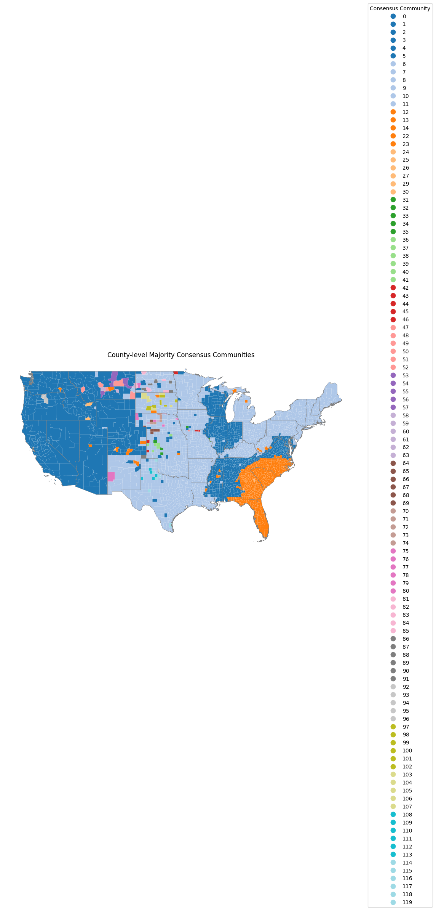

# Community Detection in U.S. County Migration Networks

## Overview

This project analyzes county-to-county migration flows in the United States as a weighted network. Counties are represented as nodes, migration flows are represented as edges, and community detection is used to identify regional migration structures.

The main analysis is contained in `Community Detection.ipynb`.

## Research Question

How do U.S. counties cluster into migration-based communities, and how does the detected community structure change across different graph resolution settings?

## Dataset Description

The notebook uses county-level migration flow data and county geographic boundary data. Raw data files are not included in this repository because they are large source files and should be downloaded separately from their original sources.

The local analysis expects files such as:

- County-to-county migration flow data
- County demographic or geographic attribute data
- County shapefiles for map visualizations

These files are intentionally excluded from Git by `.gitignore`.

## Methods

- Build a county migration network from origin-destination flow data
- Represent counties as graph nodes and migration flows as weighted edges
- Analyze graph structure using NetworkX and igraph
- Apply Louvain community detection
- Compare community assignments across multiple resolution values
- Use hierarchical clustering to summarize membership instability
- Map county-level community patterns with GeoPandas and Matplotlib

## Tools and Libraries

- Python
- Jupyter Notebook
- pandas and NumPy
- NetworkX
- python-louvain
- igraph
- GeoPandas
- Matplotlib and Seaborn
- SciPy
- scikit-learn

## Key Outputs

The project produces network and map visualizations that summarize community structure in U.S. county migration networks.

## Example Visualizations

## What I Learned

This project helped me practice turning real migration data into a graph analysis workflow. I learned how community detection can reveal regional structure in mobility networks, how resolution settings affect detected communities, and how geographic visualization can make graph results easier to interpret.

## Relevance to Graph Intelligence and Research Lab Application

This project is relevant to graph intelligence because it treats migration as a networked system rather than a table of isolated county records. The workflow connects graph construction, weighted edges, community detection, multiresolution analysis, and spatial interpretation. These skills are useful for research involving social networks, mobility systems, geographic networks, and other complex relational data.
